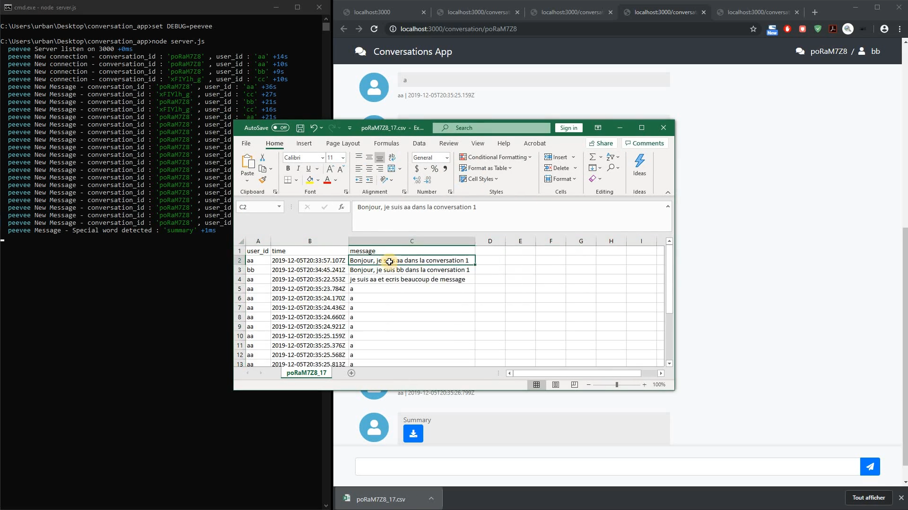

# Conversations App

## Rappel du besoin

Il s'agit de créer un petit projet node.js qui côté front end permet de saisir une conversation, et qui coté backend sauvegarde le tout et envoie la capture de la conversation lorsque l'utilisateur saisit le mot "summary".

## Démo

[](https://youtu.be/-exPsqjzhMo)

https://youtu.be/-exPsqjzhMo

## Solution

### Overview

L'**approche** prise ici est la génération de **conversations** à la **volée** et **authentification** **simple** sur nom.

Pour utilisabilité de l'application en démonstration, la **liste des conversations** est **visible** sur la page landing.

### Architecture / considérations

- **Général**
  - La feature "**summary**" a été appréhendée comme **2** features :
    - gestion de **messages spéciaux** (les messages spéciaux sont considérés ici comme messages et apparaissent dans les conversations et downloads)
    - gestion de **download** dans message
  - **Ajax api simple** pour page landing => (pas d'utilisation de Framework d'api / model )
  - Utilisation de **web sockets** pour la partie conversation **real time**
  - Pas de gestion de **fichier de config** pour faciliter la lecture du code dans le cadre de cet exercice
  - Pas d'utilisation d'approche **MVC** ou autre, ou encore du **templating** du Framework **express**
- **Server**
  - Utilisation basique du Framework **express**
  - Utilisation du module **shorid** pour la génération des id conversation
  - fastcsv
  - Utilisation du module **debug** pour le log debug 
- **Client**
  - Utilisation de la Library js **jquery**
  - Utilisation du Framework js/css **bootstrap 4**
  - Utilisation du Framework icon css **fontawesone 5**
  - Utilisation de la Library js **vue.js** pour la partie templating / réactive

### Hypothèses / Problèmes connus

- Pas de rechargement de l'**historique de la conversation** sur connexion
- Pas d'appréciation de la **sécurité** (hacking), ou de la **sécurité applicative** (visibilité d'une conversation par un non participant) ...
- Pas de gestion d'**erreur / 404**
- Pas d'appréciation de **performances**

### Evolutions imaginées

- **Fonctionnel**
  - Chargement de l'**historique de la conversation** sur connexion
  - Gestion de la **authentification / connexion** (Delegation providers facebook, ...)
  - Gestion des **localisations** , **format** number dates / **langues**
  - Gestion d'**avatar graphique** initiales / images / couleurs
  - Gestion de la **suppression/archivage** des conversations
- **Technique**
  - Gestion **config** d'application
  - Gestion de la **sécurité**
  - Gestion d'**erreur / 404**
  - Utilisation de **scss** en place du css
  - Utilisation de **webpack** pour la partie js client
  - Utilisation de **templating** pour les **messages**
  - Gestion de la **performance**

### Node Js Project

#### Structure de répertoires

```
project/
  conversations/
  static/
  views/
```

- `conversations` est le répertoire où sont stockés les **messages** de conversations et les **snapshots** issues des messages "summary"
- `static` est le répertoire où les **assets statiques** de l'application web
- `views` est le répertoire des **pages html** (statiques) utilisées pour les 2 pages web


